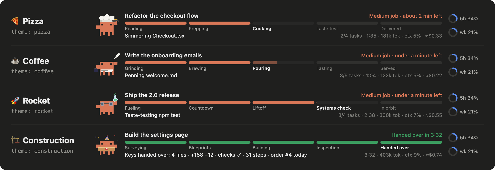

# clawd-plugins

[](https://github.com/IKnowJot/clawd-plugins/actions/workflows/scan.yml) [](https://github.com/hashgraph-online/hol-guard)

Claude Code mods, starring Clawd.


| Plugin | Type | What it does |
| --- | --- | --- |
| [clawd-tracker](plugins/clawd-tracker) | mod | A Domino's-style order tracker above the prompt. Clawd acts out whatever Claude is doing (reading, cooking up edits, taste-testing, juggling subagents) next to an honest progress bar, a learned ETA, a delivery receipt and ding, helper Clawds for subagents, plan usage and four themes. |
| [clawd-arcade](plugins/clawd-arcade) | mod | Clawd-themed games in a side pane while Claude works, starting with Clawd Conga. Pauses when Claude needs you and tells you when the order's up. |

Four shops to pick from:



## Setup

Mods use Claude Code's **function hooks**, an early-access feature that is off by default. Turn it on once by adding this to `~/.claude/settings.json`:

```json
{
  "env": {
    "CLAUDE_CODE_ENABLE_FUNCTION_HOOKS": "1"
  }
}
```

If the file already has content, add the `"env"` block next to what's there rather than replacing it.

## Install

In Claude Code:

```
/plugin marketplace add IKnowJot/clawd-plugins
/plugin install clawd-tracker@clawd-plugins
/plugin install clawd-arcade@clawd-plugins
```

Or from a terminal:

```bash
claude plugin marketplace add IKnowJot/clawd-plugins
```

```bash
claude plugin install clawd-tracker@clawd-plugins
```

Then restart Claude Code (in the desktop app, quit with Cmd+Q and reopen) and send any prompt. Toggle the tracker any time with `/tracker`.

If the install says some options aren't set yet, that's fine: every setting has a default (pizza theme, ding on, cost and plan usage shown). Change them later with `/plugin configure clawd-tracker@clawd-plugins`.

To try it for one session without installing, from a clone:

```bash
claude --plugin-dir ./plugins/clawd-tracker
```

Works in the Claude desktop app's Code tab and in the terminal. Tested on Claude Code 2.1.284 and 2.1.286; function hooks are early-access, so a later release may change them.

## Layout

```
.claude-plugin/marketplace.json   the catalog `/plugin marketplace add` reads
plugins/<name>/
  .claude-plugin/plugin.json      manifest
  hooks/hooks.json                points at the hooks module
  hooks/register.tsx              the mod itself
  types/index.d.ts                its state contract
  tests/*.test.ts                 run with `claude plugin test`
docs/                             preview images and the demo video
scripts/video/                    renders the demo video and gallery from the tracker's own code
CHANGELOG.md                      what changed in each version
```

Check before publishing:

```bash
claude plugin validate plugins/clawd-tracker
```

```bash
claude plugin test plugins/clawd-tracker
```

## License

MIT. Clawd's pixel body and the drawing approach are adapted from [johnnyvizz/claude-kit](https://github.com/johnnyvizz/claude-kit) (MIT). Clawd and Claude belong to Anthropic; this is an unofficial fan project.
