# clawd-tracker

Your Claude Code task, tracked like a pizza order.



A bar above the prompt walks through five stages, **Reading → Prepping → Cooking → Taste test → Delivered**, while Clawd acts out exactly what Claude is doing right now. Underneath: the current step, a live ETA, elapsed time, tokens, context fill, estimated cost and your plan usage.

## Clawd's 20 costumes

| Claude is… | Clawd… | Stage |
| --- | --- | --- |
| Starting your request | holds up the order ticket | Reading |
| Reading a file | puts on reading glasses, turns the pages | Reading |
| Searching code (`Grep`) | sweeps a detective's magnifier | Reading |
| Listing files (`Glob`) | ties on a bandana, scans with a spyglass | Reading |
| On the web / in a browser | rides a surfboard | Reading |
| Writing a task list or plan | scribbles on a clipboard | Prepping |
| Thinking between steps | gets a thought bubble | (stays put) |
| Editing code | flips an omelette in a chef's hat | Cooking |
| Creating a file | swings a hammer in a hard hat | Cooking |
| Editing CSS / SVG | paints in a beret, the brush changes color | Cooking |
| Editing docs (`.md`, `.txt`) | writes with a quill | Cooking |
| Editing config / other tools | turns a wrench, a gear spins | Cooking |
| Installing packages | hauls a parcel on its head | Cooking |
| Running subagents | juggles | Cooking |
| Running tests, builds, linters | swirls a bubbling flask in lab goggles | Taste test |
| Running other commands | types on a tiny laptop | (stays put) |
| Using git / gh | delivers a stamped envelope in a mail cap | (stays put) |
| Asking you a question | holds up a "?" sign | (stays put) |
| Done | party hat, confetti, pizza box | Delivered |
| A step fails | drops the pizza: "Bash hit a snag. Regrouping…" | (stays put) |
| Interrupted | drops the pizza | Stopped |

Each activity has a few verbs that rotate ("Simmering ThemeToggle.tsx", "Seasoning api.ts"), so the line never reads the same twice.

## Progress and the ETA

Claude Code can't know how far along a task is, so the bar only moves on real events:

- **With a task list** (`TodoWrite` or the task tools), the fill is the share of tasks done and slides forward each time one finishes.
- **Without one**, it fills through the furthest stage Claude has reached. Only real test, build and lint commands count as Taste test; `git` and other shell commands don't move it.
- **Delivered** fills only when the work is done. The stage being worked on pulses.

The top right shows the job size (Small, Medium or Large, from the task count or steps so far) and an estimate:

- With a task list: this run's pace per finished task ("about 3 min left"), or, before the first one finishes, your usual pace per task ("~6 min job").
- Without one: how long your past jobs that got this far usually took ("usually about 2 min left"), or "running longer than usual". The tracker remembers your last 60 delivered jobs to learn this, so it says "sizing up…" until it has a few.

## Little moments

- **Stage up**: when the work reaches a new stage, Clawd hops and sparkles.
- **Snags**: when a step fails, Clawd reacts and keeps that look while Claude works out a fix.
- **Orders today**: each delivery says which order of the day it was ("order #4 today").

## Usage numbers

- **tok**: tokens used this run, including subagents.
- **ctx**: how full the main context window is.
- **≈$**: an estimate at API list prices. On a Pro or Max plan you aren't billed per token, so treat it as a sense of scale.
- **5h / wk**: how much of your plan's 5-hour and weekly limits you've used, as reported by the last API response. Amber from 75%, red from 90%, and a one-time heads-up at 90%. Only shown on a subscription.

## Settings

Both default to on. Change them in Claude Code's `/config` menu, or in `settings.json` under `pluginConfigs`:

| Setting | What it does |
| --- | --- |
| `showCost` | Show the ≈$ estimate |
| `showPlanUsage` | Show the 5h / weekly usage and the 90% heads-up |

## Commands

- `/tracker`: show or hide the tracker. The ✕ on the bar hides it too; `/tracker` brings it back.

Works in the desktop app (animated SVG) and in the terminal (text version with an emoji per activity).



## Development

```bash
claude plugin validate plugins/clawd-tracker
claude plugin test plugins/clawd-tracker
```
